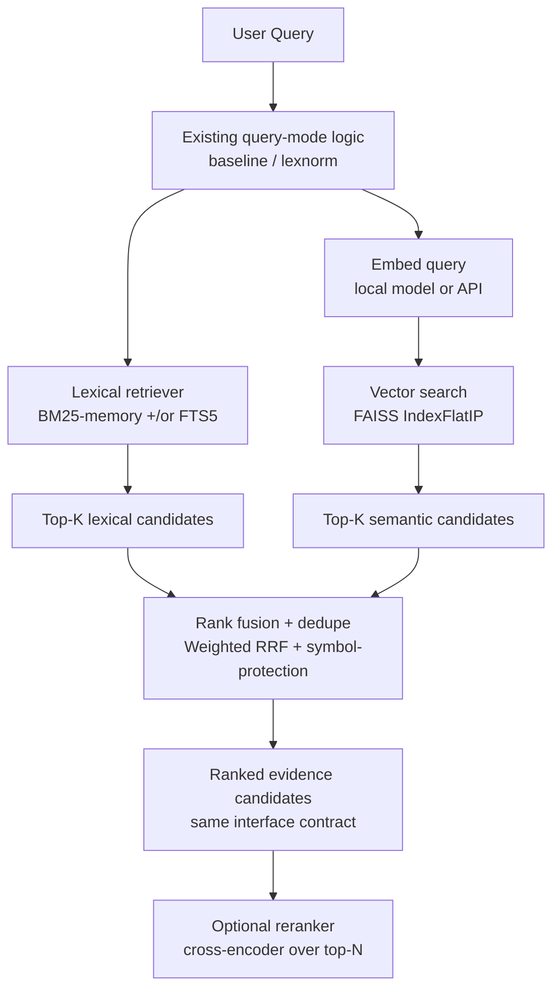

# S1 Semantic Retrieval Implementation for root-rag

## Executive Summary

This report specifies an implementation-ready design for `S1`: an opt-in, deterministic semantic retrieval layer for the `root-rag` Python code-search/RAG system that already has lexical FTS5 + in-memory BM25 baselines and a deterministic `semantic_hash_memory` semantic baseline, while keeping the frozen B0/B1 contract unchanged. fileciteturn3file0 The recommended `S1` architecture is **parallel lexical + semantic retrieval with rank-fusion**, using (a) lexical BM25/FTS5 to preserve exact symbol performance on rare identifiers and code tokens, and (b) a dense embedding retriever for concept/usage queries that have vocabulary mismatch. This design is justified by evidence from code-search literature that classic keyword search remains competitive in code due to rare terms, even while semantic methods are needed to bridge NL–code vocabulary gaps. citeturn18search0turn4view0turn13search10turn19search2 The concrete stack recommendation is **local embeddings (default) + local FAISS index (IndexFlatIP, cosine via normalization) + existing SQLite metadata**, with an optional hosted-embeddings backend (Voyage/OpenAI/Cohere) behind the same embedding interface for teams that accept vendor cost/drift. citeturn7search0turn8view1turn19search21turn6search0turn6search1turn11search4turn19search10

If stakeholders still interpret the target differently (the original prompt was “open-ended”), the project brief implies three plausible “research questions” that map to slightly different build plans: (i) **Local-only S1** (no paid APIs; maximize reproducibility), (ii) **Hosted-embeddings S1** (maximize retrieval quality quickly; accept drift/cost), (iii) **Single-file DB S1** (embed vectors inside SQLite for portability). The architecture below supports all three by swapping only the embedding backend and the vector-store backend, while preserving the retrieval contract. fileciteturn3file0

## Problem Framing

**Why lexical retrieval is strong for code symbol queries.** Code search frequently includes rare identifiers, API names, file paths, flags, error codes, and other tokens where a sparse lexical model (BM25/FTS) has a structural advantage because it can exploit exact token overlap and rarity. The CodeSearchNet authors explicitly note their keyword baseline performs “quite well” and benefits from efficiently using rare terms that appear in code, which is exactly the failure mode dense semantics often struggles with when identifiers do not map cleanly to natural language. citeturn18search0turn4view0turn13search10turn19search2

**Why semantic retrieval is needed for this repo’s query mix.** Semantic code search must bridge the mismatch between abbreviated/technical code tokens and vague natural language descriptions (e.g., a function name can be non-overlapping with the user query). CodeSearchNet highlights this “gap” with concrete examples (e.g., a `deserialize_*` function matching a query like “read JSON data”), motivating a learned semantic representation. citeturn4view0turn18search4turn5search3 The `root-rag` brief explicitly targets API usage patterns, implementation questions, and “semantically related code examples” in a C++/ROOT/FairShip-like corpus, where paraphrase and concept retrieval is central and lexical-only retrieval is insufficient. fileciteturn3file0

**Key failure modes to explicitly design around (code-oriented corpora).**  
Lexical-only retrieval fails on synonymy/paraphrase, concept queries that describe behavior rather than tokens, and cross-file patterns where the relevant snippet uses different surface forms; dense-only retrieval fails on exact symbol lookup and rare-term matching, can over-rank semantically related but wrong code, and is sensitive to chunking and embedding model choice. These trade-offs are documented across retrieval benchmarks: BM25 remains a robust baseline, while re-ranking and late-interaction often improve quality at higher compute cost. citeturn13search2turn15search0turn4view1turn7search3turn19search2 The `S1` design must therefore preserve lexical strengths and *add* semantic recall, rather than replacing lexical retrieval. fileciteturn3file0

## Candidate Approaches

The table below compares the required option set from the project brief as *engineering choices* for `S1` in a Python codebase, under the constraints of deterministic benchmarking, low refactor cost, and local developer workflows. fileciteturn3file0

| Option | Advantages | Drawbacks | Ops complexity | Cost implications | Reproducibility implications | Fit: small/medium corpora | Fit: code-heavy + symbols |
|---|---|---|---|---|---|---|---|
| Local open-source embeddings (self-host) | No vendor lock-in; can pin model+weights; can precompute embeddings offline; avoids per-query API latency and usage billing | Requires compute (CPU/GPU); model download management; inference stack (Torch/Transformers) increases CI footprint | Medium (dependency + model mgmt) | Mostly compute time + storage; no token billing | Strong if you pin versions and control seeds/hardware; still sensitive to GPU nondeterminism if used | Good; especially with compact models (≤200–600M params) | Good when combined with lexical; pure dense will still miss exact identifiers |
| Remote embedding APIs | Fast to start; usually strong general embeddings; no local GPU needed | Vendor cost; network latency; data governance; API model drift over time; rate limits | Low–Medium (auth, retries, caching, batching) | Ongoing token-based billing; can be significant at re-embed time | Drift risk even with stable model IDs; best practice is to snapshot embeddings for benchmarks | Good if corpus updates are infrequent or batchable; depends on budget | Good for concept/usage; still needs lexical for exact symbols |
| Hybrid lexical + semantic retrieval (parallel + fusion) | Usually best practical coverage: lexical for rare terms, semantic for paraphrase; resilient to token mismatch; incremental addition without breaking B0/B1 | Requires fusion logic and tuning; debugging rank interactions | Medium | Adds embedding cost + vector index cost | Can be deterministic if you pin everything; fusion itself is deterministic | Strong default | Best overall: protects identifier queries and expands semantic recall |
| Pure semantic retrieval | Simple conceptual story; single score | Will regress exact symbol queries; hard to guarantee “no drowning” without additional logic; chunk noise and embedding bias can dominate | Low | Embedding + index cost | Deterministic possible, but regressions likely and hard to detect without robust eval | Acceptable only if users rarely do symbol search | Poor for corpora with many rare identifiers unless heavily engineered |
| Late fusion / reranking (two-stage ranking) | Can substantially improve ranking quality by scoring query–doc pairs directly (cross-encoder / late interaction) | Inference cost per query scales with candidates; heavier dependencies; adds latency | Medium–High | Higher compute per query; possibly still manageable at top-50/top-100 | Deterministic under fixed weights/mode, but more moving parts | Good when top-k is small | Very strong if used as optional stage after hybrid retrieval |
| Vector DB vs lightweight local index | Managed DBs offer metadata filtering, persistence, tooling; local indexes are easiest to embed in dev workflows | DB adds ops (service, docker, networking); local index adds file mgmt but is simpler | DB: High, Local: Low–Medium | DB: infra cost, Local: mostly disk | Local indices can be tightly versioned; services add version drift & nondeterministic infra variables | Local is excellent; DB useful only if scaling/filters are major | Local is excellent; DB helpful if heavy filtering by metadata is required |

Evidence supporting “hybrid as default” is strong in both code-search-specific observations (keyword baselines do well on rare terms) and general IR benchmarking (BM25 strong, reranking strongest but costly), making hybrid retrieval + optional reranking a rational engineering optimum. citeturn18search0turn13search2turn7search3turn15search0turn4view1

## Embedding Model Research

This section compares serious embedding candidates for code/documentation retrieval, emphasizing: (a) code capability, (b) embedding dimensions and context length, (c) licensing/operational constraints, and (d) fit for symbol vs concept queries. The project brief explicitly requires both local/open and hosted options. fileciteturn3file0

### Model comparison table

| Candidate | Provider/source | Code support evidence | Typical embedding dim | Context length (not exhaustive) | Strengths for `root-rag` | Weaknesses / caveats | License / usage constraints |
|---|---|---:|---:|---:|---|---|---|
| **jina-embeddings-v2-base-code** | entity["company","Jina AI","ai embeddings company"] (open weights via entity["company","Hugging Face","ml platform company"]) | Model card: pretrained on GitHub code + trained on code QA/docstring–code pairs; designed for mixed English + code inputs and multiple programming languages | 768 | Supports long inputs (8192 tokens) per model family/paper | Strong “code + prose” co-embedding; moderate size (~161M params) supports practical local inference; long-context reduces need for aggressive fragmentation | Still benefits from chunking; may not preserve exact symbol ranking alone; local inference depends on Torch/Transformers | Open model weights; operationally self-hosted or via API depending on deployment choice citeturn9search1turn14search2turn5search0 |
| **BGE-M3** | entity["organization","Beijing Academy of Artificial Intelligence","research institute"] (FlagEmbedding ecosystem) | Multi-function embedding model supporting dense + lexical + multi-vector retrieval modes | 1024 | Up to 8192 tokens (reported in docs/ecosystem) | Versatile: single model can support dense + sparse representations; strong benchmark presence; large ecosystem | Larger model (reported ~568M params) increases local inference cost; multi-functionality can add integration complexity if only dense is needed | Model use via FlagEmbedding; open distribution and active maintenance citeturn9search13turn9search9turn9search6turn7search2 |
| **UniXcoder-base** | entity["company","Microsoft","software company"] (research + open model) | Paper and model card target code representation; code search examples; embeddings shown as 768-d vectors | 768 | Example uses max_length=512 in docs | Well-known “code search” oriented model; can be a lightweight baseline for semantic code search | Older compared to 2024–2026 embedding models; shorter input length (practical) increases chunking burden; may underperform newer instruction-tuned embedders | Apache-2.0 per model card citeturn10view0turn5search10turn5search18 |
| **text-embedding-3-large / 3-small** | entity["company","OpenAI","ai research company"] | Official docs specify dimensions and max tokens; general retrieval strength cited by OpenAI | 3072 (large), 1536 (small) by default | 8192 tokens | Very strong general embeddings; easy API integration; flexible dimension parameter; consistent SDK ecosystem | Token cost + API dependency; potential drift; must snapshot embeddings for benchmarking; dimension increases memory significantly | Usage governed by API terms; paid usage citeturn6search0turn19search10turn6search15turn6search22 |
| **embed-english-v3.0 / embed-v4** | entity["company","Cohere","ai company"] | Official docs list model families and dimensions; v4 adds Matryoshka dims and large context | 1024 (v3), variable dims for v4 | v4 reports very large context in changelog | Mature hosted option; variable dimensions in newer models; enterprise integration | Vendor lock-in + cost; drift and rate limits; not code-specialized by default | API usage terms; paid usage citeturn6search1turn6search5turn6search23turn6search13 |
| **voyage-code-3 / voyage-3.5** | entity["company","Voyage AI","embedding model vendor"] | Vendor blog claims code-retrieval optimization and multi-dataset evaluation; supports multiple dimensions + quantization | 2048/1024/512/256 configurable | 32K tokens claimed | Strong hosted “best-in-class for code retrieval” positioning; long context can reduce chunk fragmentation; flexible dims and quantization for storage savings | Vendor dependency; must validate on your own benchmark; cost/latency depend on batching | API usage; paid usage; supports quantized formats per docs citeturn11search4turn11search10turn11search13turn11search8turn6search2turn6search10 |

### Ranked shortlist for root-rag

**Best local option: `jina-embeddings-v2-base-code`**. The most direct evidence-to-requirement match is that this model is explicitly trained for mixed English+code and is grounded in GitHub code and code QA/docstring pairs, aligning with “code + documentation retrieval” needs and keeping inference feasible on typical developer machines relative to substantially larger embedders. citeturn9search1turn5search0turn14search2turn14search15

**Best hosted option: `voyage-code-3`**. Among hosted embedders, it is explicitly marketed and evaluated as a code-retrieval-optimized embedding model with flexible dimensions and quantization options. The long context length also reduces the operational pain of chunking long functions/files, which often affects C++ corpora. citeturn11search4turn11search10turn11search13

**Best overall recommendation for `S1`: hybrid retrieval using local embeddings by default, with a hosted backend as a drop-in configuration.** Hybrid retrieval is the most robust way to preserve exact symbol behavior while adding semantic recall, consistent with code-search evidence that keyword baselines exploit rare terms well and with broader IR benchmarking showing hybrid + reranking often dominates single-stage methods (at higher compute). citeturn18search0turn13search2turn4view1turn7search3turn15search0

## Indexing and Storage Design

The brief requires comparing FAISS, SQLite-based vector storage, DuckDB+vector extension, Chroma, Qdrant, and plain local file-based options, and then recommending one concrete path for `S1`. fileciteturn3file0

### Storage/index options comparison

| Option | Pros | Cons | Python integration | Determinism / reproducibility | CI friendliness | Fit for local dev workflows |
|---|---|---|---|---|---|---|
| **FAISS (local)** | Mature library for similarity search; supports exact and ANN indexes; has explicit index I/O APIs; widely used | Separate index artifact(s) + metadata mapping; some ANN builds (e.g., HNSW add) can vary with threading order | Excellent (native + Python wrappers) citeturn7search0turn14search8turn8view1 | Designed for determinism with fixed seeds; known exceptions (multithreaded HNSW add; PCA/OPQ with LAPACK) are documented citeturn14search0turn2search5turn14search14 | Good via wheels (`faiss-cpu`) but binaries are large; still common in CI citeturn12search1turn12search13 | Strong: no server, easy version pinning, good performance |
| **SQLite-based vector storage (`sqlite-vec`, `sqlite-vss`)** | Single-file “local-first” DB story; integrates well with existing SQLite usage; straightforward deployment (`pip install sqlite-vec`) | `sqlite-vec` focuses on brute-force search and is pre-v1; extension loading can be fragile across platforms; `sqlite-vss` depends on FAISS under the hood | Good in Python; explicit Python loading instructions | Deterministic for brute-force similarity; operational determinism depends on extension versioning | Medium: native extensions can break on some environments; issues exist | Strong for small/medium corpora if portability is the priority citeturn12search0turn18search14turn18search2turn3search1turn12search15 |
| **DuckDB + VSS extension** | Attractive “single process DB with vector indexes” concept; supports HNSW indexing | Documented as experimental; extension maturity and persistence semantics may change | Good, but still evolving | Potentially reproducible, but “experimental” implies churn risk | Medium; extra extension loading and version pinning | Moderate; best when DuckDB is already central citeturn3search2turn18search3turn18search7turn18search11turn18search15 |
| **Chroma (local/server)** | Easy to start; common tutorials; supports persistence via server path | More moving parts than necessary for a minimal `S1`; past issues about differing behaviors across clients exist | Good client ecosystem | Determinism depends on backend/storage; harder to pin end-to-end | Medium–High | Moderate; best if you already use Chroma in stack citeturn3search4turn3search21turn3search26 |
| **Qdrant (service)** | Strong metadata filtering primitives; purpose-built vector DB with HNSW and payload indexing | Requires service (container/daemon); ops complexity; determinism discussions exist in issues | Good clients; service requirement | Determinism depends on version + settings; service adds variables | Low–Medium (needs service in CI) | Moderate; best when multi-user/server deployment is required citeturn3search16turn3search8turn3search12turn3search43 |
| **Plain file-based brute-force (NumPy)** | Minimal dependencies; maximally transparent | Slow beyond modest corpus sizes; reinventing indexing/persistence | Easy | Deterministic | Excellent | Only acceptable as fallback or for tiny corpora |

### Recommended index path for S1

**Recommendation: FAISS exact search (IndexFlatIP) + SQLite metadata mapping, with a clear upgrade path to ANN only if/when scale requires it.** The exact-search approach is the best fit for deterministic benchmarking and minimal-risk implementation: it avoids ANN tuning and reduces nondeterminism risks (HNSW build order), while still being fast enough for tens to low-hundreds of thousands of embeddings in typical local dev workflows. FAISS documents both flat indexes (sequential comparisons) and the write/read APIs needed to persist the index artifact. citeturn7search4turn19search8turn8view1turn7search0

**Cosine similarity in FAISS.** Use inner product with L2-normalized vectors to get cosine-equivalent ranking, which FAISS explicitly documents as the recommended recipe for cosine similarity. citeturn19search21turn11search13turn19search1

### Quantitative sizing aid (vector memory)

Even before ANN, vector dimension choices strongly affect memory and local UX. The table below shows raw embedding storage costs (excluding metadata, index overhead, and Python object overhead).

| Embedding dims | Vectors | float32 storage | int8 storage | binary storage |
|---:|---:|---:|---:|---:|
| 768 | 100k | ~293 MB | ~73 MB | ~9.2 MB |
| 1024 | 100k | ~391 MB | ~98 MB | ~12.2 MB |
| 2048 | 100k | ~781 MB | ~195 MB | ~24.4 MB |
| 3072 | 100k | ~1.17 GB | ~293 MB | ~36.6 MB |

These numbers follow directly from bytes-per-dimension (4 for float32, 1 for int8, 1/8 for binary). Vendor docs for quantized embeddings corroborate the expected ~4× (int8) and ~32× (binary) storage reduction vs float32 in systems that support such dtypes. citeturn11search10turn11search16turn11search4turn6search0turn19search10

## Retrieval Architecture Recommendation

This section specifies the concrete `S1` retrieval architecture, including query flow, embedding flow, fusion strategy, and the “do not drown symbols” guardrails required by the brief. fileciteturn4file1

### Proposed S1 architecture (parallel retrieval + fusion)

citeturn4view1turn13search10turn7search0turn19search21turn7search3turn7search2

### Fusion and “symbol protection” strategy

**Base fusion: Weighted Reciprocal Rank Fusion (RRF).** The original RRF paper defines a simple, unsupervised fusion score that sums reciprocal ranks with a constant *k* (the SIGIR’09 paper describes *k=60* as fixed in pilot experiments). citeturn4view1 A practical weighted variant for two retrievers:

\[
\text{score}(d)=\frac{w_\text{lex}}{k+r_\text{lex}(d)}+\frac{w_\text{sem}}{k+r_\text{sem}(d)}
\]

where missing ranks contribute 0 (treat as absent from that list). This avoids the “incomparable score scales” problem (BM25 vs cosine/IP) because it fuses ranks rather than raw scores. citeturn4view1turn15search1

**Symbol-protection guardrail (critical for B0/B1 contract expectations).** The safest minimal-risk mechanism is a *deterministic post-fusion constraint*:

*If the query is “symbol-like”, then force the final top-M results to include the lexical top-M (deduped), and only allow semantic/fused results to fill below that.*

A “symbol-like” classifier can be a simple heuristic (inference): high proportion of non-space punctuation, presence of `::`, `->`, `()`, template-like `<...>`, CamelCase/underscore density, long tokens, or path-like strings. The justification is consistent with CodeSearchNet’s observation that keyword baselines efficiently capture rare terms in code, which semantic models may not reliably preserve at rank-1. citeturn18search0turn4view0

A concrete policy that is easy to benchmark and tune:

- If *symbol-like*: `w_lex=0.85`, `w_sem=0.15`, and **pin lexical top-3** into final top-3 (stable order), then fill remaining slots by fused ranking.
- Else: `w_lex=0.45`, `w_sem=0.55`, and no pinning (pure fused order).

This is intentionally conservative to prevent exact-symbol regressions while still allowing semantic recall to help “usage pattern” queries. fileciteturn3file0

### Optional reranking stage

The highest-yield optional stage after fusion is a **cross-encoder reranker** over the top-N deduped candidates (e.g., N=50–200). Cross-encoder reranking with transformer models has long been known to produce significant IR gains, albeit at higher compute per query (Nogueira & Cho’s “Passage Re-ranking with BERT” is a canonical early result). citeturn7search3turn16search3turn13search2 The FlagEmbedding project explicitly recommends reranking the top-k from an embedder using BGE rerankers. citeturn7search2turn7search6turn7search9

### Chunking and Corpus Preparation

The brief requires concrete chunking guidance for code corpora, including function-level vs sliding windows, metadata inclusion, and header/source handling. fileciteturn4file1

**Recommendation: primary unit = function/method-level chunk, with deterministic fallback splitting for oversized units.** This aligns with CodeSearchNet’s corpus construction: it is built around functions/methods paired with documentation comments (docstrings), which is a strong empirical precedent that function-level indexing is a natural granularity for code retrieval. citeturn4view0turn18search4

**Suggested chunk schema (what to embed).** For each chunk, embed a *structured text view* that mixes code and normalized metadata:

- `repo_rel_path`: e.g., `src/tracking/Foo.cxx`
- `symbol`: namespace/class/function if extractable
- `signature`: return type + function name + params (best-effort parse)
- `doc/comment`: doxygen/docstring block (if any)
- `code`: function body, lightly normalized (whitespace stable, strings optionally truncated)
- `language`: `cpp`, `python`, etc.
- `include/context`: optionally include the nearest preceding comment block and the first few lines of surrounding context (bounded)

Including file path and symbol metadata is widely recommended in practice to improve retrieval context and debugging; research also highlights the usefulness of metadata/symbol constraints for retrieval tasks where lexical signals matter (e.g., file paths as retrieval targets). citeturn2search14turn2search3turn18search0

**Headers vs sources (C++/scientific code).** Treat `*.h`/`*.hpp` and `*.cxx`/`*.cc`/`*.cpp` as separate documents but link via shared symbol name/signature when possible. Many “usage pattern” queries will be satisfied by declarations (headers) while implementation questions require source; returning both is often ideal, so store a `kind ∈ {declaration, definition}` metadata field and allow result grouping in the UI layer later (inference). fileciteturn3file0

**Oversized functions: deterministic splitting.** When a single function exceeds the embedder context limit, split deterministically at syntactic boundaries (e.g., blank lines or brace-depth heuristics) into overlapping subchunks (e.g., overlap ~10–20 lines), and prepend the same `repo_rel_path + signature + doc` header to each subchunk. This preserves stable chunk IDs and reduces semantic drift by keeping signature/doc information in every subchunk. Embedding APIs explicitly enforce max token limits, so deterministic truncation or chunking is required for correctness. citeturn6search12turn6search22turn11search13turn14search2

## Benchmark and Evaluation Design

The repo has frozen benchmark tracks B0/B1/S0; the brief requires a plan to evaluate S1 against B0, including metrics, artifacts, and “symbol regression” detection. fileciteturn4file1

### Metrics to report (offline retrieval)

At minimum, report **MRR@K** and **nDCG@K**, plus a simple recall metric (Recall@K or Hit@K). This choice is consistent with standard IR evaluation practice: nDCG is grounded in the cumulated-gain family of metrics (Järvelin & Kekäläinen) and is widely used to evaluate ranked retrieval with graded relevance, while reciprocal-rank metrics have deep roots in TREC QA evaluation. citeturn17search0turn17search2turn17search1turn17search9 CodeSearchNet itself reports MRR for code retrieval baselines, making MRR an especially natural metric for your domain. citeturn4view0turn18search0

Practical reporting set (suggested):

- Overall: `MRR@10`, `nDCG@10`, `Recall@10`
- Tail: `Recall@50` (if you care about downstream reranking)
- Latency: mean/p95 retrieval time for lexical-only, semantic-only, and fused
- Index stats: number of chunks, dimension, storage size of vectors + index

### Required evaluation artifacts

Directly matching the brief, add:

- `benchmark_eval_results_S1.json`: store per-query ranks, scores, and summary metrics for reproducibility and regression detection. fileciteturn4file1  
- `benchmark_semantic_comparison_S1.md`: a human-readable delta report versus B0/B1, highlighting “wins”, “losses”, and representative examples. fileciteturn4file1  

### Detecting “semantic helps concepts but hurts symbols”

Implement a query stratification layer for analysis (inference):

1) **Symbol-like queries**: heuristic detection as described earlier (punctuation-heavy, identifier-like).  
2) **Concept/usage queries**: natural language descriptions, “how do I…”, “example of…”, etc.  
3) **Mixed queries**: includes both symbol and explanation.

Then report metrics per stratum and compute deltas `S1 - B0` to prevent “overall improvement hiding symbol regressions.” This is directly motivated by evidence that keyword baselines excel on rare terms in code. citeturn18search0turn4view0

### Gating criteria for keeping S1

A conservative, implementation-friendly gate (inference but aligned to the brief’s priorities):

- **No-regression gate (symbols):** `MRR@10(symbols)` must not decrease by more than a small tolerance (e.g., ≤1–2% relative) vs B0, and `Hit@1(symbols)` must not drop materially.
- **Value-add gate (concepts):** `MRR@10(concepts)` should improve by a meaningful threshold (e.g., ≥5% relative) *or* the count of “first relevant in top-5” should increase by a fixed number.
- **Stability gate:** identical reruns with fixed seeds and pinned versions must reproduce the same rankings (bitwise if feasible), in line with your “deterministic and reproducible benchmarking matters” constraint. fileciteturn3file0

FAISS provides explicit documentation of reproducibility expectations and known exceptions in multithreaded settings, which should be referenced in your reproducibility checklist for S1. citeturn14search0turn2search5turn14search14

## Implementation Plan

The brief requests a staged plan with minimal risk phases, including scope, code changes, risks, and validation steps. fileciteturn4file1

### Staged rollout plan (minimal-risk)

| Phase | Scope | Expected code changes | Key risks | Validation steps |
|---|---|---|---|---|
| Embedding backend abstraction | Define `Embedder` interface and config; support local + hosted backends | New module: `embeddings/` with `embed(texts)->np.ndarray`; config wiring | Dependency bloat; nondeterministic inference if not in eval mode | Unit tests: deterministic outputs for fixed text on CPU; snapshot test vectors; version pinning |
| Corpus embedding generation | Deterministic chunker + embedding pipeline; emit `chunks.jsonl` + `vectors.npy` (or similar) | New CLI: `build_s1_corpus_index`; stable chunk IDs | Chunk instability causing benchmark drift | Repeat build twice: identical chunk IDs; deterministic split tests; token-length guard tests citeturn6search12turn6search22 |
| Vector index integration | Build FAISS IndexFlatIP + ID mapping; persist index artifact | New module: `vector_index/faiss_index.py`; store `index.faiss` + `chunk_meta.sqlite` | Incorrect normalization breaks cosine/IP equivalence | Tests: cosine equivalence via L2 normalization; round-trip `write_index/read_index` citeturn19search21turn8view1 |
| Benchmark track S1 | Add retriever mode `S1` behind opt-in flag; keep B0/B1 untouched | Extend retriever registry; add `S1` track runner | Accidentally changes B0/B1 behavior | Golden tests: B0/B1 unchanged outputs; S1 produces outputs of same schema fileciteturn3file0 |
| Hybrid fusion tuning | Implement weighted RRF + symbol protection; tune weights on dev benchmark | New fusion module + config; query classifier | Overfitting to benchmark; symbol regressions | Stratified metric reports; gating; ablation tests with fixed candidate sets citeturn4view1turn18search0 |
| Optional reranker | Add cross-encoder reranker over top-N candidates | Optional dependency + rerank pipeline | Latency blowup; GPU dependency in CI | Bench latency + quality; enable only if wins are clear; keep off by default citeturn7search3turn7search2turn13search2 |

### Recommended Dependencies

This list is constrained to packages that directly support an implementation-ready S1 and are compatible with local/CI workflows.

| Package | Why needed | Core vs optional | Installation complexity | CI safety notes |
|---|---|---|---|---|
| `faiss-cpu` | Local vector search, exact and ANN indexes; supports index persistence | Core | Medium (binary wheel) | Widely used wheel; still pin versions for reproducibility citeturn12search1turn8view1turn14search0 |
| `numpy` | Vector arrays, normalization, storage | Core | Low | Stable |
| `sentence-transformers` (+ `torch`, `transformers`) | Practical local embedding inference for HF models | Core (if local embeddings) | Medium–High | Pin Torch/Transformers; run in eval mode; prefer CPU for deterministic benchmarks citeturn12search2turn12search11turn9search1 |
| `FlagEmbedding` | BGE-M3 embedding + BGE rerankers if you choose that path | Optional | Medium | Adds model downloads and heavier inference; isolate behind flags citeturn7search2turn9search6turn7search6 |
| `openai` SDK | Hosted OpenAI embeddings (optional backend) | Optional | Low | Requires API key + cost control; snapshot embeddings for benchmarks citeturn6search0turn6search22turn6search15 |
| `voyageai` SDK | Hosted Voyage embeddings (optional backend) | Optional | Low | Requires API key; validate claims on your benchmark citeturn11search8turn11search4turn11search13 |
| `sqlite-vec` | Alternative embedded vector store (single SQLite file) | Optional | Medium (native extension) | Can be brittle on some platforms; keep as optional backend citeturn12search0turn18search14turn18search2 |
| `tree-sitter` (or similar parser) | Higher-quality function-level chunking for C++/Python | Optional | Medium | Improves chunk stability/quality; not mandatory for phase-one |

## Risks and Tradeoffs

### Reproducibility risks

- **ANN nondeterminism:** FAISS explicitly documents that multithreaded HNSW `add` can be non-reproducible due to unspecified insertion order; PCA/OPQ training can vary at machine precision with some LAPACK/MKL behaviors. Mitigation: start with IndexFlatIP; if moving to HNSW/IVF later, build indexes single-threaded and pin library versions. citeturn14search0turn14search14turn2search5turn8view1  
- **GPU inference nondeterminism:** neural embedding inference can vary slightly across hardware/backends; for benchmark determinism, prefer CPU inference or strict determinism settings and snapshot embeddings. citeturn2search12turn12search11turn13search2

### API drift risks (hosted embeddings)

Hosted providers can change model behavior, pricing, or availability. Even if model IDs remain stable, you must treat “embedding generation” as a versioned build artifact for benchmarks (store embeddings + model ID + timestamp + SDK version). This is especially relevant because the `root-rag` brief stresses deterministic benchmarking. fileciteturn3file0 The OpenAI embedding docs emphasize fixed model families and dimensions, but do not eliminate drift risk; operationally, snapshotting is still required. citeturn6search0turn6search15turn19search10

### Cost and latency risks

Embedding the corpus is usually the dominant cost for hosted APIs, while per-query embedding adds latency and potential rate-limit constraints. Providers offer various batching/job mechanisms, but each adds operational surface area. citeturn6search31turn6search22turn11search8turn11search4 Local embeddings shift cost to compute and can be optimized via inference backends/quantization, but still increase dependency weight. citeturn12search11turn14search2

### CI fragility risks

Binary dependencies (FAISS wheels, native SQLite extensions) can fail on niche CI platforms or older glibc. Prefer the simplest stable path (FAISS wheel + pure-python metadata store) and keep `sqlite-vec` as optional. citeturn12search1turn12search15turn12search9

### Evaluation overfitting risks

Hybrid fusion has tunable knobs (weights, candidate sizes, pinning). Without a hold-out query set, it’s easy to overfit the benchmark. Mitigation: keep fusion policy simple and stratified; report per-query deltas; use frozen test splits; avoid tuning on the final benchmark set. citeturn13search2turn4view1turn15search0

### Exact-symbol regression risks

This is the single highest practical risk for developer-facing code search. The mitigations (symbol-like detection + lexical pinning + stratified gating) are low-complexity, deterministic, and directly motivated by code-search evidence about rare terms. citeturn18search0turn4view0turn13search10

### Final Recommendation

**Single recommended S1 architecture:** parallel lexical + semantic retrieval with deterministic rank fusion; apply symbol-protection pinning for symbol-like queries; keep reranking as an optional future stage. citeturn4view1turn18search0turn13search2

**Single recommended embedding model strategy:** default to **local `jina-embeddings-v2-base-code`** for reproducibility and code-orientation; maintain a clean interface that also supports a hosted backend (Voyage/OpenAI/Cohere) behind configuration for teams that prioritize fastest “quality now” over cost/drift. citeturn9search1turn14search2turn11search4turn6search0turn6search1

**Single recommended vector/index stack:** **FAISS IndexFlatIP (exact) + L2 normalization + persisted index + SQLite metadata mapping**; only introduce ANN later if corpus size or latency requires it, and then follow FAISS reproducibility guidance. citeturn19search21turn7search4turn8view1turn14search0

**Single recommended rollout path:** implement the phased plan above with strict gating on symbol-like queries, ship S1 as opt-in, and produce the two evaluation artifacts (`benchmark_eval_results_S1.json`, `benchmark_semantic_comparison_S1.md`) as the primary mechanism for keeping or rejecting S1. fileciteturn4file1

**Prioritized primary sources (concise):**  
- CodeSearchNet Challenge paper (code-search task definition + evidence on lexical baseline strength + MRR reporting). citeturn4view0turn18search0  
- Reciprocal Rank Fusion (RRF) paper (rank-fusion formula and rationale). citeturn4view1  
- BM25 foundations (Robertson & Zaragoza, “BM25 and Beyond”). citeturn13search10  
- FAISS documentation (index types, index I/O, determinism caveats). citeturn7search0turn8view1turn14search0turn19search21turn14search8  
- Embedding model primary docs/papers: Jina Embeddings 2 and jina-embeddings-v2-base-code model card; OpenAI embeddings docs; Voyage code-3 docs/blog; Cohere embed docs. citeturn14search2turn9search1turn19search10turn6search0turn11search4turn6search1