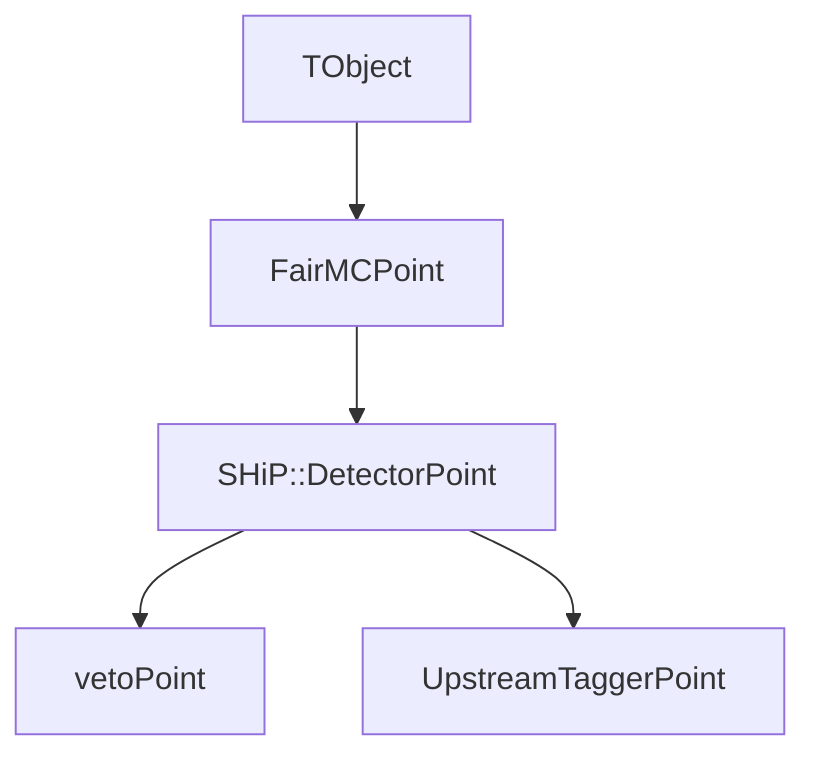

# Data Structures, Memory Footprint, and Dependencies

This document provides an in-depth analysis of the data structures used in the Muon DIS workflow, explaining their memory footprint, composition, and inheritance dependencies.

## Core Dependencies
The Muon DIS branches rely heavily on the ROOT framework and the FairRoot simulation toolkit.
- **ROOT Data Structures**: `TVectorD`, `TClonesArray`, `TVector3`.
- **FairRoot Base Classes**: `FairMCPoint` (usually wrapped as `SHiP::DetectorPoint` in FairShip).

## 1. TVectorD Usage (`InMuon`, `DISParticles`, `SoftParticles`)

Instead of creating custom C++ classes for each interaction product, the workflow uses `TVectorD` stored inside `TClonesArray` objects. 

### Implementation Characteristics
- `TVectorD` is a dynamic vector of `Double_t` (8-byte floating point numbers).
- It inherits from `TVector` and `TObject`.

### Memory Footprint Analysis
The memory footprint of a `TVectorD` includes the `TObject` overhead (usually 16-24 bytes depending on a 64-bit system), array sizing variables, and the dynamically allocated `double` array.

- **`InMuon`**: Uses `TVectorD(14)`.
  - Array Data Size: $14 \times 8 = 112$ bytes.
  - Typical in-memory size per muon: ~150-160 bytes.
- **`DISParticles`**: Uses `TVectorD(5)` (`pid`, `px`, `py`, `pz`, `E`).
  - Array Data Size: $5 \times 8 = 40$ bytes.
  - Typical in-memory size per particle: ~80-90 bytes.
  - *Context*: A high multiplicity DIS interaction (e.g., 50 particles) adds ~4.5 KB per event.
- **`SoftParticles`**: Uses `TVectorD(9)`.
  - Array Data Size: $9 \times 8 = 72$ bytes.

### Why `TClonesArray`?
A `TClonesArray` is used rather than `std::vector<TVectorD>` because it avoids the overhead of repeated heap allocations and destructions for each event. It reuses previously allocated memory, which is crucial for high-multiplicity particle stacks generated by `makeMuonDIS.py`.

## 2. Detector Points (`vetoPoint`, `UpstreamTaggerPoint`)

Unlike the bare vectors used for physics kinematics, detector interactions use specific class implementations.

### Inheritance Dependency Graph

*Note: `SHiP::DetectorPoint` extends `FairMCPoint` to add SHiP-specific geometry abstractions, while `FairMCPoint` belongs to the core `FairRoot` framework.*

### Composition & Footprint
Both `vetoPoint` and `UpstreamTaggerPoint` are structurally similar, containing kinematic states exactly at the entrance of their respective active volumes.

Data members inherited from `FairMCPoint`:
- `trackID` (`Int_t`): 4 bytes
- `detID` (`Int_t`): 4 bytes
- `pos` (`TVector3` - x, y, z): 24 bytes
- `mom` (`TVector3` - px, py, pz): 24 bytes
- `tof` (`Double_t`): 8 bytes
- `length` (`Double_t`): 8 bytes
- `eLoss` (`Double_t`): 8 bytes

**Total Payload Size**: ~80 bytes.
**Total In-Memory Size**: ~100-112 bytes per hit (including vtable and `TObject` pointers).

## Exploitation Takeaways for Future Development
1. **Schema Rigidness**: The reliance on hardcoded integer indices for `TVectorD` (e.g., `InMuon[10]`) introduces structural fragility. If you expand `InMuon` to 15 elements, all Python (`makeMuonDIS.py`) and C++ (`MuDISGenerator.cxx`) index access points must be manually aligned. 
2. **Refactor Opportunity**: For better type-safety, a custom `MuonDISKinematics : public TObject` class could be introduced in FairShip to replace `TVectorD`, storing fields like `xsec` and `nDIS` natively rather than overloading double arrays.
3. **Overhead**: Because `TVectorD` is polymorphic and stored in a `TClonesArray`, reading `muonDis.root` has slightly higher I/O overhead compared to flat `std::vector<double>` branches, though `TClonesArray` mitigates some of this during serialization.